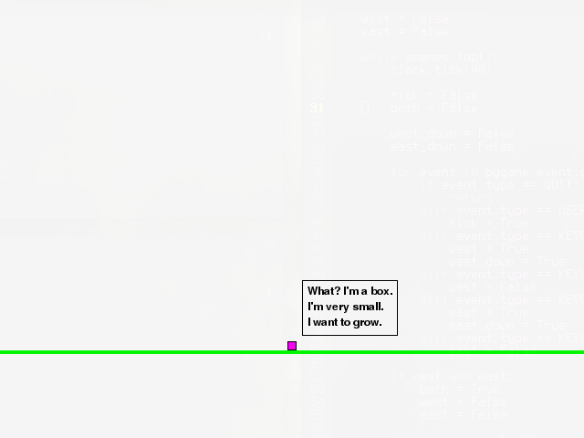

# Grbox - Grow a Box!

This is a demo for [LudumDare34](http://ludumdare.com/compo/ludum-dare-34/?action=preview&uid=64969).

You start being a little box :black_small_square:. Eating fruits like :apple:, :cherries: and :strawberry:; you become  :black_medium_small_square: and bigger :black_large_square:.

The theme was *Growing* and *Two button controls*.

 * You can only press _left_ (:arrow_left:), right (:arrow_right:) or both at the same time.
 * Your objetive is to grow (:wink:).

Requirements: Python2 + PyGame.
